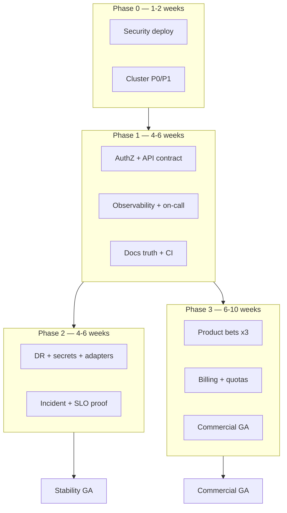

# GA Remediation & Implementation Plan

> **Created:** 2026-05-22 · **Last updated:** 2026-05-29  
> **Status:** Active program plan  
> **Audience:** Platform engineering, SRE, product, GTM  
> **Supersedes narrative only:** “95% ready” marketing copy until gates below are met  
> **Master blueprint:** [COMMERCIAL_GA_MASTER_PLAN.md](./COMMERCIAL_GA_MASTER_PLAN.md) — waves, timeline, risks, 100% definition

This document is the **single program plan** for moving Enclii from **release candidate** to **stability GA** and **commercial GA**. It consolidates:

- [CODEBASE_AUDIT_2026-05.md](./CODEBASE_AUDIT_2026-05.md) — code remediation (May 2026)
- [SECURITY_RELEASE_PR.md](./SECURITY_RELEASE_PR.md) — production security deploy
- [REMEDIATION_PLAN.md](./REMEDIATION_PLAN.md) — Session 106 + infra phases
- [REMAINING_ITEMS.md](./REMAINING_ITEMS.md) — cluster execution queue
- [GAP_ANALYSIS.md](./GAP_ANALYSIS.md) — competitive table stakes
- [../ADAPTER_GAPS.md](../ADAPTER_GAPS.md) — Enclii-first ops gaps
- [../architecture/SOFTWARE_SPEC.md](../architecture/SOFTWARE_SPEC.md) — GA acceptance tests

**Operating doctrine:** Enclii web, API, or CLI for routine production work. Break-glass `kubectl`/SSH only with documented reason; record adapter gaps.

---

## 1. Definitions

| Milestone | Meaning | Customer-facing? |
|-----------|---------|------------------|
| **RC** | Production-running; known gaps documented | Internal / design partners |
| **Stability GA** | SLO-backed, secure multi-tenant, DR proven, on-call ready | Yes — “production grade” |
| **Commercial GA** | Stability GA + billing enforcement + 3 shipped product bets + SLA/support | Yes — “generally available” |

**Stability GA** does not require edge, multi-region, or full managed-DB marketplace.  
**Commercial GA** requires explicit **scope choices** (Section 6), not 100% green on [ENCLII_CAPABILITY_MATRIX.md](../architecture/ENCLII_CAPABILITY_MATRIX.md) (stale; refresh in Phase 1).

### Global exit criteria (both tracks)

```
Security:
  [ ] SECURITY_RELEASE_PR checklist complete in production
  [ ] AuthZ integration test matrix green (tenant isolation by UUID)
  [ ] No Sev-1 security incidents in last 30 days post-deploy

Operations:
  [ ] Restore drill passed (documented evidence)
  [ ] Vault unsealed; secrets on canonical path (Vault + ESO)
  [ ] Cluster disk <40%, CPU alloc <75%, ArgoCD synced
  [ ] Incident runbook exercised once (tabletop or real)

Quality:
  [ ] CI: security-scan + unit/UI/E2E green on main
  [ ] Doc-guard blocking on main (zero drift policy)
  [ ] OpenAPI is source of truth for public API; sdk-ts generated or verified

SLO (Stability GA minimum):
  [ ] 99.95% API availability measured 30 days (per SOFTWARE_SPEC)
  [ ] P95 deploy pipeline and log tail within spec targets
  [ ] Zero unmitigated P1s open >7 days

Commercial GA adds:
  [ ] Waybill/budget enforcement on critical paths
  [ ] Three product bets shipped OR feature-flagged off (Section 6)
  [ ] SLA doc, support tier, security questionnaire, GA changelog published
```

---

## 2. Current state (May 2026)

**Program readiness (2026-05-29):** Stability GA ~74% · Commercial GA ~70%. Engineering for bets A+B+C ~90%; critical path is ops proof, 30-day SLO, and GTM publish — not net-new features. See [COMMERCIAL_GA_MASTER_PLAN.md §2](./COMMERCIAL_GA_MASTER_PLAN.md) and [GA_READINESS_SCORECARD.md](./GA_READINESS_SCORECARD.md).

### Done in code (do not re-do)

| Area | Evidence |
|------|----------|
| Security hotfixes | `CODEBASE_AUDIT_2026-05.md` Phase 0 |
| AuthZ foundation | `access.go`, scoped `ListProjects`, IDOR guards |
| UI/CLI HTTP convergence | `lib/api.ts`, `ws-url.ts`, CLI `apiRequest` |
| Reconciler constants | `internal/reconciler/defaults.go` |
| CI | `security-scan` gated; Makefile namespace `enclii` |
| Docs | `ADAPTER_GAPS.md`, `GOLDEN_TESTS.md`, `DEV_ENV_ALIGNMENT.md` |

### Not done (blocks GA)

| Area | Blocker level |
|------|----------------|
| Security deploy checklist | **P0** — ops |
| Cluster P0/P1 (`REMAINING_ITEMS`) | **P0** — ops |
| Staging lifecycle proofs (bets A/B/C) | **Done** — Actions run 26328015825 (2026-05-23) |
| 30-day SLO window | **P0** — starts after Wave 0+1 sign-off |
| AuthZ proof tests + handler audit | **Done** — PR #250 on `main` |
| Product bets A/B/C code | **Done** on `main` — staging proven |
| Reconciler queue metrics + alerting | **P1** — eng/ops (metrics done; alerting tune) |
| Structured API errors (50+ handlers) | **P1** — eng (post-GA acceptable) |
| sdk-ts / OpenAPI sync in UI | **P1** — eng (incremental; previews/volumes shipped) |
| Commercial wrap publish (SLA, support, changelog) | **P1** — GTM/legal after SLO window |

---

## 3. Program structure

Six workstreams run in parallel after Phase 0 gates:



| WS | Name | Lead | Primary artifacts |
|----|------|------|-------------------|
| **WS-A** | Security & tenancy | Backend | Tests, pen test, `SECURITY_RELEASE_PR` |
| **WS-B** | Platform SRE & DR | Ops | `REMAINING_ITEMS`, restore drill, Vault |
| **WS-C** | API contract & quality | Backend + FE | OpenAPI, sdk-ts, structured errors |
| **WS-D** | Observability & incident | SRE | Metrics, Loki ops, runbooks, canary decision |
| **WS-E** | Product table stakes | Product + Backend | Previews, domains, PVCs, etc. |
| **WS-F** | Commercial & GTM | Product + Legal | SLA, pricing, support, matrix refresh |

---

## Phase 0 — Deploy blockers (Week 0–2)

**Goal:** Production matches May security code; cluster no longer one disk spike from outage.

### 0.1 Security production deploy (WS-A) — P0

| # | Task | Done when |
|---|------|-----------|
| 0.1.1 | Set `ENCLII_ROUNDHOUSE_API_KEY` API + Roundhouse | Callbacks + `git_repo` work in prod |
| 0.1.2 | Verify Roundhouse sends bearer on Switchyard calls | Integration log / test callback |
| 0.1.3 | Smoke: non-admin project list scoped | Manual + automated smoke |
| 0.1.4 | Smoke: UUID routes deny cross-tenant | cron, junction, deployment, service |
| 0.1.5 | Communicate dashboard stats auth change | Changelog / customer comms if external users |

Ref: [SECURITY_RELEASE_PR.md](./SECURITY_RELEASE_PR.md)

### 0.2 Cluster stability (WS-B) — P0

Execute in order from [REMAINING_ITEMS.md](./REMAINING_ITEMS.md):

| # | Task | Est. | Done when |
|---|------|------|-----------|
| 0.2.1 | PostHog scale-down, PVC + detached volume cleanup | 15m | `df` ~target; namespace empty |
| 0.2.2 | Longhorn helm upgrade (committed CPU values) | 10m | instance-managers <200m |
| 0.2.3 | Disk prune (crictl, journal, logs) | 10m | disk <40% |
| 0.2.4 | ArgoCD sync sweep | 10m | All apps Synced/Healthy (except known) |
| 0.2.5 | Backup credentials + restore drill job | 25m | Drill log: success |
| 0.2.6 | Vault init → unseal → migrate (runbook) | 60m | Sealed=false; ESO syncing |
| 0.2.7 | Cosign enforce (phased namespaces) | 20m | Labels + policy verified |

**Phase 0 exit:** 0.1 checklist + 0.2.5 restore drill + disk/CPU targets met.

---

## Phase 1 — Stability foundation (Weeks 2–8)

**Goal:** Prove multi-tenant safety and operability; align contracts and docs with code.

### 1.1 AuthZ hardening (WS-A) — P0

| # | Task | Notes |
|---|------|-------|
| 1.1.1 | AuthZ integration test matrix | Table: role × resource × verb; fixture users A/B |
| 1.1.2 | Handler audit: every UUID route calls `enforceUserProjectAccess` or equivalent | Grep + review checklist in PR |
| 1.1.3 | Wire or remove dead `internal/auth/rbac.go` | Single RBAC story for API tokens |
| 1.1.4 | Optional: external pen test / OWASP ZAP in CI | Before Commercial GA |

### 1.2 API contract (WS-C) — P0

| # | Task | Notes |
|---|------|-------|
| 1.2.1 | Structured error type + middleware | Replace ad-hoc `gin.H{"error"}` on **protected** routes first |
| 1.2.2 | OpenAPI regen + breaking-change policy | Version or announce deprecations |
| 1.2.3 | Generate or verify `packages/sdk-ts` from OpenAPI | CI `sdk-ts.yml` + canonical `docs/api/openapi.yaml`; UI workspace dep still open |
| 1.2.4 | Finish Janua-adjacent raw `fetch` audit | Document as external boundary in `DEV_ENV_ALIGNMENT.md` |
| 1.2.5 | Golden test policy | Regenerate only in dedicated PRs; `GOLDEN_TESTS.md` |

### 1.3 Reconciler & deploy safety (WS-D + Backend) — P1

| # | Task | Notes |
|---|------|-------|
| 1.3.1 | Prometheus metrics: queue depth, reconcile latency, failures | Alert thresholds in Grafana |
| 1.3.2 | StatefulSet rollout state + `rollout_blocked_reason` | API + UI surface |
| 1.3.3 | Canary: implement Prometheus error check **or** disable feature | Half-canary worse than off |
| 1.3.4 | Auto-rollback (SOFTWARE_SPEC TC-02) | 5xx >2% for 2m → rollback + alert |

Deferred from May audit: see `CODEBASE_AUDIT_2026-05.md` Phase 4.

### 1.4 Test coverage (WS-C) — P1

Execute Tier 1–2 from [REMEDIATION_PLAN.md](./REMEDIATION_PLAN.md) Phase 2 (~94 tests):

- `monitoring`, `compliance`, `clients`, `notifications` (Tier 1)
- `health`, `lockbox`, `logging`, `storage` (Tier 2)

**Skip** low-ROI packages per REMEDIATION_PLAN unless GA gate requires them.

### 1.5 Docs & CI truth (WS-F) — P1

| # | Task |
|---|------|
| 1.5.1 | Refresh `ENCLII_CAPABILITY_MATRIX.md`, `REMAINING_ITEMS.md`, `PRODUCTION_DEPLOYMENT_ROADMAP.md` dates/status |
| 1.5.2 | Make doc-guard **blocking** on `main` |
| 1.5.3 | CLI: 7 command docs from REMEDIATION_PLAN Phase 3 |
| 1.5.4 | Docusaurus: fix broken links; `onBrokenLinks: throw` |

**Phase 1 exit:** AuthZ matrix green; queue metrics + alerts live; OpenAPI/sdk-ts path defined; doc-guard blocking.

---

## Phase 2 — Operational maturity (Weeks 6–12)

**Goal:** 30-day SLO evidence; Enclii-first ops; incident-ready.

### 2.1 Observability (WS-D)

From REMEDIATION_PLAN Phase 4 (prioritized subset):

| # | Task | GA priority |
|---|------|-------------|
| 2.1.1 | Loki + Fluent Bit **operational** (retention, dashboards, runbook) | P0 |
| 2.1.2 | Grafana dashboards versioned (API, builds, Longhorn, ArgoCD, cost) | P1 |
| 2.1.3 | AlertManager: Slack for critical; PagerDuty optional for Commercial GA | P1 |
| 2.1.4 | HPA: switchyard-api, switchyard-ui, roundhouse-api | P1 |
| 2.1.5 | Kyverno: audit → enforce for limits/probes | P2 |

### 2.2 DR & secrets (WS-B)

| # | Task |
|---|------|
| 2.2.1 | Quarterly restore drill automated + evidence stored |
| 2.2.2 | Control plane Postgres persistence audit | Fix emptyDir if still true in prod overlay |
| 2.2.3 | k3s encryption at rest (REMEDIATION_PLAN 5C) |
| 2.2.4 | Close [ADAPTER_GAPS.md](../ADAPTER_GAPS.md) P1 rows (secrets via Enclii) |

### 2.3 Enclii-first adapters (WS-B + Backend)

| Gap | Target | Priority |
|-----|--------|----------|
| Production build secrets | `enclii secrets` + ESO | P1 |
| Makefile `deploy-prod` | GitOps-only / `enclii deploy` | P2 |
| Cloudflare secrets | `enclii providers cloudflare` | P2 |

### 2.4 Incident & SLO (WS-D)

| # | Task |
|---|------|
| 2.4.1 | Exercise [INCIDENT_RESPONSE.md](../runbooks/INCIDENT_RESPONSE.md) (tabletop) |
| 2.4.2 | Publish SLO dashboard + error budget policy |
| 2.4.3 | 30-day stability window: zero Sev-1, 99.95% API |

**Phase 2 exit:** **Stability GA** — all global exit criteria (Section 1) met.

---

## Phase 3 — Commercial GA (Weeks 10–20)

**Goal:** Sellable product with three finished bets and billing truth.

### 3.1 Product bets — pick exactly three (WS-E)

Choose at program kickoff; **do not** block GA on all GAP_ANALYSIS items.

| Bet | Scope (MVP) | Est. | Ref |
|-----|-------------|------|-----|
| **A. Preview environments** | PR webhook → `preview-{branch}` env → URL → cleanup on close | 4–6 wk | GAP_ANALYSIS § DX |
| **B. Custom domains + TLS** | cert-manager, domain API, DNS verify, Junction routing | 4–6 wk | GAP_ANALYSIS § Networking |
| **C. Persistent volumes** | PVC in reconciler, lifecycle, UI volume attach | 2–4 wk | GAP_ANALYSIS § Data |
| **D. Managed DB (lite)** | Helm addon Postgres/Redis per project, secret inject | 6–10 wk | GAP_ANALYSIS § Data |
| **E. Jobs/Timetable GA** | E2E + UI parity with API; or flag off | 2–4 wk | Roadmap |

**Recommended default for Commercial GA:** **A + B + C** (DX + networking + state). Defer **D** to post-GA unless GTM requires it.

For each bet:

```
[ ] API + reconciler + UI
[ ] E2E test (SOFTWARE_SPEC style)
[ ] Docs + CLI command doc
[ ] Feature flag default for rollback
```

### 3.2 Billing & quotas (WS-F)

| # | Task |
|---|------|
| 3.2.1 | Waybill: enforce budget caps on deploy/build (not just showback) |
| 3.2.2 | Quota API surfaced in UI + CLI |
| 3.2.3 | Billing FAQ aligns with product (`docs/faq/billing.md`) |

### 3.3 Commercial wrap (WS-F)

| # | Task |
|---|------|
| 3.3.1 | SLA document (99.95% aligns with SOFTWARE_SPEC) |
| 3.3.2 | Support tiers + status page process |
| 3.3.3 | Security questionnaire / SOC2 roadmap (honest scope) |
| 3.3.4 | GA changelog; retire “95% ready” in customer-facing docs |
| 3.3.5 | Pricing page + self-serve signup path tested |

**Phase 3 exit:** **Commercial GA** — three bets shipped + commercial checklist (Section 1).

---

## Phase 4 — Explicit post-GA deferrals

Do **not** schedule before Commercial GA unless contractually required:

| Item | Rationale |
|------|-----------|
| Multi-region / edge | 6–12 mo; GAP_ANALYSIS Critical |
| ESO CRD 0.9 → 0.16 | Maintenance window; not if secrets work |
| PostgreSQL HA / Redis Sentinel | When SLA >99.9% sold |
| GPU nodes | Hardware-dependent |
| Full Railway DB marketplace | Bet D or later |
| PagerDuty | Email+Slack sufficient for Stability GA |
| Distributed tracing (Tempo) | After Loki stable |
| Ecosystem repo hygiene (REMEDIATION_PLAN Phase 6) | Parallel, non-blocking |

---

## 4. CI & release train

| Gate | Requirement |
|------|-------------|
| PR | Unit + UI tests; security-scan on touched areas |
| `main` | Full CI + doc-guard + integration smoke |
| Production | GitOps/Enclii deploy only; Phase 0 security checklist |
| Release tag | GA checklist section signed by Eng + Ops leads |

**Release cadence suggestion:** weekly `main` → prod after Phase 0; bi-weekly feature releases during Phase 3.

---

## 5. RACI (lightweight)

| Decision | Accountable | Consulted | Informed |
|----------|-------------|-------------|----------|
| Product bet selection (§3.1) | Product | Eng, GTM | All |
| Security deploy go/no-go | Ops + Security | Backend | Customers (if breaking) |
| Stability GA sign-off | Platform lead | SRE, Backend | GTM |
| Commercial GA sign-off | Product + GTM | Legal, Platform | Customers |

---

## 6. Tracking & hygiene

1. **This file** — program phases and exit criteria  
2. **[REMAINING_ITEMS.md](./REMAINING_ITEMS.md)** — cluster task queue (update weekly)  
3. **[CODEBASE_AUDIT_2026-05.md](./CODEBASE_AUDIT_2026-05.md)** — code checklist (check off per PR)  
4. **GitHub milestone:** `GA-2026-Q3` with issues per task ID (`1.1.1`, etc.)  
5. **Weekly:** 15-min standup — Phase 0 blockers first, then WS progress  

When a row in `ADAPTER_GAPS.md` closes, remove it and link the PR.

---

## 7. Timeline summary

| Phase | Calendar | Milestone |
|-------|----------|-----------|
| 0 | Weeks 0–2 | Secure prod + healthy cluster |
| 1 | Weeks 2–8 | AuthZ proof, contracts, metrics |
| 2 | Weeks 6–12 | SLO window, DR, on-call |
| 3 | Weeks 10–20 | Commercial GA |

**Stability GA:** ~12 weeks from Phase 0 start (parallel Phase 1+2).  
**Commercial GA:** +8–10 weeks for three product bets + billing (overlap Phase 2 tail).

---

## 8. Immediate next actions (2026-05-29)

See [COMMERCIAL_GA_MASTER_PLAN.md §9](./COMMERCIAL_GA_MASTER_PLAN.md) for the full wave schedule. This week:

1. Complete [SECURITY_RELEASE_PR.md](./SECURITY_RELEASE_PR.md) checklist (O-3) and Gate 1 sign-off.  
2. Execute [REMAINING_OPS_GA.md](./REMAINING_OPS_GA.md) O-5–O-6 (Longhorn CPU, disk prune).  
3. Wave 1: restore drill (O-9), Vault/ESO (O-10), Cosign enforce (O-11).  
4. Start legal review of [SLA_DRAFT.md](./SLA_DRAFT.md) and privacy/terms draft (parallel during SLO window).  
5. **Product bets A+B+C:** confirmed and staging-proven; no re-scope required.  

---

## Appendix A — Issue ID index

| ID | Summary |
|----|---------|
| 0.1.x | Security production deploy |
| 0.2.x | Cluster P0/P1 |
| 1.1.x | AuthZ |
| 1.2.x | API contract / sdk-ts |
| 1.3.x | Reconciler / canary / rollback |
| 1.4.x | Test tiers |
| 1.5.x | Docs / CI |
| 2.1.x | Observability |
| 2.2.x | DR / Postgres persistence |
| 2.3.x | Adapter gaps |
| 2.4.x | Incident / SLO |
| 3.1.x | Product bets |
| 3.2.x | Billing |
| 3.3.x | Commercial wrap |

---

## Appendix B — Related documents

| Document | Role |
|----------|------|
| [COMMERCIAL_GA_MASTER_PLAN.md](./COMMERCIAL_GA_MASTER_PLAN.md) | **Master blueprint** — waves, timeline, 100% definition |
| [GA_REMEDIATION_PLAN.md](./GA_REMEDIATION_PLAN.md) | **This plan** — phases, workstreams, exit criteria |
| [COMMERCIAL_GA_EXECUTION_ROADMAP.md](./COMMERCIAL_GA_EXECUTION_ROADMAP.md) | Time-ordered wave summary |
| [CODEBASE_AUDIT_2026-05.md](./CODEBASE_AUDIT_2026-05.md) | Code audit status |
| [REMEDIATION_PLAN.md](./REMEDIATION_PLAN.md) | Detailed infra/test phases |
| [REMAINING_ITEMS.md](./REMAINING_ITEMS.md) | Cluster ops queue |
| [GAP_ANALYSIS.md](./GAP_ANALYSIS.md) | Competitive gaps |
| [SECURITY_RELEASE_PR.md](./SECURITY_RELEASE_PR.md) | Security deploy gate |

## Production-readiness ratchet rollout

`production-readiness-ratchet.yml` runs in warn-only mode until the current baseline is clean. After baseline cleanup, promote the workflow to enforced mode for PRs that touch production manifests, workspace package exports, or probe configuration.
