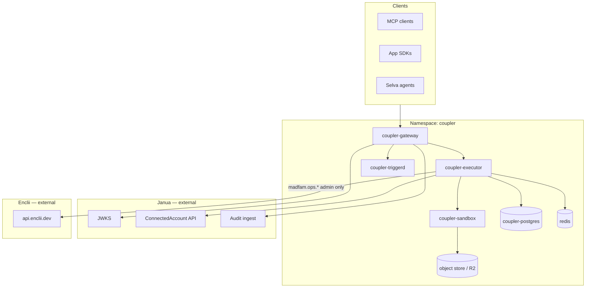

# Agent Tool Plane (Coupler) — Implementation & Ecosystem Integration Plan

**Status:** execution-ready (see [COUPLER_REMEDIATION_PLAN.md](./COUPLER_REMEDIATION_PLAN.md))  
**Last updated:** 2026-05-30  
**License (new repo):** AGPL-3.0-only, public  
**Composio policy:** zero spend, zero runtime dependency on Composio Cloud or Enterprise

---

## 1. Executive summary

MADFAM needs **Composio-class capabilities** (delegated end-user auth, tool catalog, execute API, MCP, sandbox, triggers) without paying Composio or embedding that complexity inside **Enclii** (PaaS) or **Janua** (identity).

**Decision:** create a **fourth platform** in its own public repo — working name **Coupler** (`madfam-org/coupler`) — the **Agent Tool Plane (ATP)**.

| Platform | Owns | Must NOT own |
|----------|------|--------------|
| **Janua** | Human/service identity, org tenancy, RBAC, **ConnectedAccount vault**, OAuth *token storage*, audit *subject* | Tool execution, connector code, sandboxes |
| **Enclii** | Deploy, scale, observe, **operator** provider actions (`providers.*`), GitOps, platform secrets | End-user SaaS connectors, user delegated OAuth UX |
| **Selva** | LLM routing, agent orchestration, session *reasoning* | Credential storage, connector long tail |
| **Coupler (ATP)** | Tool registry, search, execute, MCP, sandbox, triggers, connector SDK | User login, cluster deploy, billing |

**Integration style:** thin, documented **contracts** (JWT, HTTP APIs, events). No shared database between Coupler and Enclii/Janua. No imports of Enclii/Janua code into Coupler core (SDK clients only).

---

## 2. Design principles

1. **Separation of concerns** — ATP is not a submodule of `switchyard-api` or `janua-api`.
2. **Zero-touch onboarding** — after bootstrap, new connectors and ecosystem apps do not require commits to enclii/janua ([ZERO_TOUCH_CONTRACT](../guides/ZERO_TOUCH_CONTRACT.md)).
3. **Janua-first identity** — ATP never issues human passwords; it validates Janua RS256 JWTs and uses Janua for ConnectedAccount CRUD.
4. **Enclii-first ops** — ATP deploys *through* Enclii like every other repo; platform operator tools stay on Enclii Provider Hub.
5. **Sovereign execution** — all production tool execution runs on MADFAM k3s; no third-party agent middleware SaaS.
6. **AGPL cohesion** — public repo, network use if deployed as service; aligns with Enclii ecosystem licensing story.
7. **Two trust zones**
   - **User zone:** delegated SaaS tools (`coupler.slack.*`, `coupler.gmail.*`) — end-user connections.
   - **Operator zone:** infra tools (`madfam.ops.*`) — proxied to Enclii `providers.*` / `ops.*`, admin JWT only.

---

## 3. Repository charter

### 3.1 New repo

| Field | Value |
|-------|--------|
| GitHub org | `madfam-org` |
| Repo name | **`coupler`** (rename OK before public launch) |
| Visibility | Public |
| License | **AGPL-3.0-only** (+ `LICENSE`, SPDX headers) |
| Default branch | `main` |
| Container registry | `ghcr.io/madfam-org/coupler/<service>` |

### 3.2 Initial monorepo layout

```
coupler/
├── LICENSE                          # AGPL-3.0
├── AGENTS.md                        # Agent operating guide
├── ECOSYSTEM.md                     # Self-contained MADFAM context (generated pattern)
├── enclii.yaml                      # Enclii onboard manifest
├── README.md
├── docs/
│   ├── architecture/
│   │   ├── OVERVIEW.md
│   │   ├── TRUST_BOUNDARIES.md
│   │   └── JANUA_ENCLII_CONTRACTS.md
│   ├── connectors/
│   │   └── CONNECTOR_SDK.md
│   └── openapi/
│       └── coupler-v1.yaml
├── apps/
│   ├── gateway/                     # REST + MCP entry (Go or TS)
│   ├── executor/                    # Tool execution workers
│   ├── sandbox/                     # Ephemeral job runner controller
│   └── triggerd/                    # Inbound webhook normalizer
├── packages/
│   ├── sdk-typescript/              # @madfam/coupler
│   ├── sdk-python/                  # madfam-coupler
│   ├── mcp-server/                  # Cursor / Claude MCP
│   └── connector-sdk/               # Schema + test harness for connectors
├── connectors/                      # Tier-1 bundled connectors (AGPL)
│   ├── github/
│   ├── slack/
│   ├── gmail/
│   ├── notion/
│   └── linear/
├── k8s/
│   └── production/                  # Kustomize; CI pins digests
├── infra/
│   └── helm/                        # Optional wrapper chart
└── .github/workflows/
    └── ci.yml                       # Enclii-compatible CI pattern
```

### 3.3 What stays out of this repo

- Enclii `switchyard-api` operator handlers
- Janua user model / login UI
- Selva LLM inference stack (consumes Coupler via HTTP only)
- Dhanam billing (future integration via API, not embedded)

---

## 4. Architecture

### 4.1 Runtime services (Coupler namespace)



| Service | Responsibility |
|---------|----------------|
| **gateway** | AuthZ, rate limits, `search_tools`, `execute_tool`, `connections` proxy, MCP SSE |
| **executor** | Resolve connector + connection, call upstream API, normalize errors, emit audit |
| **sandbox** | Spawn isolated Jobs for multi-step / code-style tool composition |
| **triggerd** | Verify Slack/GitHub/etc. signatures, map to subscriptions, enqueue runs |

### 4.2 Data ownership

| Data | Owner DB | Notes |
|------|----------|-------|
| Users, orgs, roles | Janua | ATP stores only Janua `sub` / `org_id` foreign keys |
| OAuth tokens, API keys for SaaS | Janua ConnectedAccount | ATP requests short-lived **delegation tokens** or vault-side decrypt via Janua API — tokens never logged |
| Tool definitions, versions | Coupler Postgres | Connector manifests + JSON Schema |
| Execution logs, plans | Coupler Postgres | Retention policy; PII minimization |
| Large tool payloads | R2 / object store | Signed URLs for agent filesystem pattern |
| Platform operator creds | Enclii Vault / ESO | ATP never stores Cloudflare root tokens |

---

## 5. Boundary contracts (hard rules)

### 5.1 Janua ↔ Coupler

**Janua provides (build in Janua, consume from Coupler):**

| API | Purpose |
|-----|---------|
| `GET /.well-known/jwks.json` | JWT verification (RS256 only) |
| `GET /api/v1/connections` | List user/org connections (metadata only) |
| `POST /api/v1/connections/:provider/authorize` | Start OAuth |
| `GET /api/v1/connections/:id/token` | **Privileged** — short-lived token for execute (ATP service account + user context) |
| `DELETE /api/v1/connections/:id` | Revoke |
| `POST /api/v1/audit/events` | ATP posts `tool.executed`, `connection.used` |

**Janua MUST NOT:**

- Implement connector-specific API calls (Slack, Gmail, etc.)
- Host MCP servers for third-party SaaS
- Store tool execution state

**Coupler MUST NOT:**

- Store long-lived refresh tokens in its own DB (delegate to Janua ConnectedAccount)
- Issue its own human login sessions (only service-to-service + Janua JWT passthrough)
- Duplicate Janua org/user tables

**JWT claims used by Coupler:**

```json
{
  "sub": "user-uuid",
  "oid": "org-uuid",
  "tid": "tenant-id",
  "aud": "coupler-api",
  "scope": "coupler:tools:execute coupler:connections:read",
  "roles": ["member"]
}
```

Register OAuth client via Janua (`janua provision apply -f janua.client.yaml`) with audience **`coupler-api`**.

### 5.2 Enclii ↔ Coupler

**Enclii provides:**

| Capability | Usage |
|------------|--------|
| `POST /v1/admin/onboard` | Bootstrap `coupler` namespace, tunnel, ArgoCD app, Janua client |
| `providers.*` / `ops.*` | **Operator zone only** — ATP proxies `madfam.ops.*` actions |
| GHCR + digest GitOps | Standard CI → kustomize pin → Argo sync |
| Observability hooks | Status page entries via `enclii.yaml` |

**Enclii MUST NOT:**

- Add Gmail/Slack/Notion operator adapters to switchyard-api for agent use cases
- Merge Coupler execution into `switchyard-api` process

**Coupler MUST NOT:**

- Call `kubectl` or mutate cluster state directly (use Enclii API for ops tools)
- Depend on Enclii for end-user SaaS OAuth

**Operator proxy pattern:**

```
POST /v1/tools/execute
  tool: madfam.ops.providers.cloudflare.dns-apply
  → Coupler validates admin role
  → Coupler calls api.enclii.dev/v1/providers/cloudflare/dns-apply
  → Returns Enclii operation_id in unified audit envelope
```

### 5.3 Selva ↔ Coupler

- Selva agents call Coupler **`/v1/tools/*`** or MCP — not Janua/Enclii directly for SaaS actions.
- Selva owns LLM prompts, planning, multi-turn reasoning.
- Coupler returns structured tool results; Selva may re-invoke LLM via `/v1` (Selva).

### 5.4 Ecosystem apps ↔ Coupler

Consumer apps (Opennote-class):

1. Authenticate users with Janua (standard OIDC).
2. Use `@madfam/coupler` SDK or MCP with user's Janua access token.
3. Never embed connector API keys in app repos.

---

## 6. Public API surface (v1)

Base URL: `https://coupler-api.madfam.io` (landing: `https://coupler.madfam.io`). Avoid 3-level subdomains (`api.coupler.*`).

### 6.1 REST (OpenAPI)

| Method | Path | Description |
|--------|------|-------------|
| `GET` | `/v1/tools/search?q=...` | Intent / keyword tool discovery |
| `GET` | `/v1/tools` | List tools (filter by toolkit, scope) |
| `GET` | `/v1/tools/{tool_id}` | Schema + metadata |
| `POST` | `/v1/tools/execute` | Execute tool (dry_run supported) |
| `POST` | `/v1/tools/plan` | Multi-step plan preview (optional v1.1) |
| `GET` | `/v1/connections` | Proxy to Janua (metadata) |
| `POST` | `/v1/connections/{provider}/authorize` | Start OAuth (redirect URL) |
| `DELETE` | `/v1/connections/{id}` | Revoke |
| `GET` | `/v1/sessions/{id}` | Session context (files, pending plan) |
| `POST` | `/v1/triggers` | Register trigger subscription |
| `GET` | `/health` | Enclii status contract |

**Execute request shape:**

```json
{
  "tool": "coupler.slack.post_message",
  "connection_id": "uuid-from-janua",
  "dry_run": false,
  "arguments": { "channel": "C123", "text": "Hello" },
  "reason": "user-requested via app XYZ"
}
```

**Execute response envelope (aligned with Enclii operator pattern):**

```json
{
  "ok": true,
  "execution_id": "exec_...",
  "data": {},
  "audit_id": "aud_...",
  "janua_connection_id": "..."
}
```

### 6.2 MCP server (`packages/mcp-server`)

Tools exposed to Cursor/Claude:

- `coupler_search_tools`
- `coupler_execute_tool`
- `coupler_manage_connections`
- `coupler_list_sessions` (optional)

Auth: Janua PKCE or personal access token with `coupler:*` scopes.

### 6.3 Tool naming convention

| Prefix | Zone | Example |
|--------|------|---------|
| `coupler.{app}.{action}` | User delegated | `coupler.gmail.send_email` |
| `madfam.ops.{domain}.{action}` | Admin proxy → Enclii | `madfam.ops.providers.cloudflare.zones` |
| `madfam.app.{repo}.{action}` | Ecosystem-registered | `madfam.app.dhanam.create_invoice` |

---

## 7. Connector model

### 7.1 Connector package structure

Each connector is an AGPL module implementing:

```yaml
# connectors/slack/coupler.yaml
id: slack
version: 1.0.0
auth:
  type: oauth2
  janua_provider: slack
  scopes: [chat:write, channels:read]
tools:
  - id: post_message
    name: coupler.slack.post_message
    input_schema: ./schemas/post_message.json
    output_schema: ./schemas/post_message.out.json
    risk: medium
```

Runtime: Go or WASM-isolated plugins (prefer **Go in-tree** for v1 — simpler on k3s).

### 7.2 Tier-1 launch set (parity MVP)

| Toolkit | Auth | Priority tools |
|---------|------|----------------|
| GitHub | OAuth / App | create_issue, create_pr, list_repos |
| Slack | OAuth | post_message, list_channels |
| Gmail | OAuth | send_email, list_threads |
| Notion | OAuth | create_page, query_database |
| Linear | OAuth | create_issue, list_teams |
| Google Calendar | OAuth | create_event, list_events |

**Platform parity features (not connector count):** search, execute, MCP, sandbox (basic), triggers (GitHub + Slack), audit.

### 7.3 Long tail strategy

- **`CONNECTOR_SDK.md`** — third parties and MADFAM repos publish connectors without Janua/Enclii changes.
- Connectors can live in `coupler/connectors/` or external repos + registry URL.
- Verification: schema tests + recorded HTTP fixtures (no live secrets in CI).

---

## 8. Janua implementation prerequisites

Coupler **depends** on Janua shipping ConnectedAccount (ADR-002). Split responsibility:

| Work item | Repo | Owner |
|-----------|------|-------|
| `connected_accounts` + `provider_types` migrations | janua | Identity |
| Encrypt/decrypt service (Vault or app-level AES-GCM) | janua | Identity |
| OAuth broker UI + callback routes | janua | Identity |
| `GET /connections/:id/token` service API (ATP-only scope) | janua | Identity |
| Connector OAuth app registration (per provider) | janua + coupler docs | Joint |
| Tool execute + audit | coupler | ATP |

**Critical:** Janua OAuth broker stores tokens; Coupler receives **ephemeral** access for one execute call where possible.

---

## 9. Enclii implementation prerequisites

| Work item | Repo | Notes |
|-----------|------|-------|
| `enclii.yaml` + k8s manifests in coupler repo | coupler | Zero-touch |
| `POST /v1/admin/onboard` for project `coupler` | enclii (one-time) or onboard script | Namespace `coupler` |
| Ecosystem map entry in `ECOSYSTEM.md` | enclii + janua | Docs only |
| Optional: `enclii providers` **read-only** catalog link in Switchyard UI | enclii | Link out to Coupler docs, not merge UIs |
| Service account for ATP → Enclii ops proxy | enclii + janua | Machine token with admin scope |

**No changes** to Provider Hub for SaaS connectors.

---

## 10. Security & compliance

| Control | Implementation |
|---------|----------------|
| Tenant isolation | Janua `oid`/`tid` on every execute; row-level checks in Coupler |
| Secret handling | Janua vault only; redact in logs |
| Network | Coupler `enclii.yaml` egress allowlist: Janua API, Selva, Enclii API, provider HTTPS |
| Sandbox | Dedicated namespace `coupler-sandbox`, NetworkPolicy deny-all default, no cluster metadata |
| Audit | Dual-write: Coupler execution log + Janua audit event |
| Rate limits | Per org + per connection |
| AGPL | Service deployment over network triggers source offer — document in README |

---

## 11. Phased implementation roadmap

### Phase 0 — Charter & bootstrap (2 weeks)

- [ ] Create `madfam-org/coupler` repo (AGPL, templates, CI skeleton)
- [ ] Publish this plan to `coupler/docs/architecture/OVERVIEW.md`
- [ ] Add ECOSYSTEM.md (MADFAM map + Coupler role)
- [ ] Register Janua OAuth client `coupler-api`
- [ ] Draft Janua ↔ Coupler OpenAPI contract (PR to janua docs)

### Phase 1 — Janua Keyring GA (4–6 weeks, **janua**)

- [ ] Implement ConnectedAccount model (ADR-002)
- [ ] OAuth authorize/callback for GitHub + Slack (reference providers)
- [ ] Service API: token delegation for ATP
- [ ] Audit event ingest endpoint

**Gate:** Coupler cannot reach prod until Phase 1 minimal API exists.

### Phase 2 — Coupler core (6–8 weeks)

- [ ] gateway: JWT auth, health, OpenAPI v1
- [ ] executor: single-tool execute with Janua token fetch
- [ ] 2 connectors: GitHub + Slack
- [ ] Postgres schema: tools, executions, sessions
- [ ] Enclii onboard + staging deploy

### Phase 3 — Developer surface (4 weeks)

- [ ] `@madfam/coupler` TypeScript SDK
- [ ] MCP server (search + execute + connections)
- [ ] Selva integration example

### Phase 4 — Parity features (8–10 weeks)

- [ ] Tool search (embedding via Selva or local)
- [ ] Sandbox runner (K8s Job per execution)
- [ ] triggerd: GitHub + Slack inbound
- [ ] 4 more tier-1 connectors (Gmail, Notion, Linear, Calendar)
- [ ] `madfam.ops.*` Enclii proxy (admin only)

### Phase 5 — Ecosystem (ongoing)

- [ ] Connector SDK + external registry
- [ ] Dhanam metering hook (optional entitlements)
- [ ] GA proof: synthetics, claim matrix, runbooks

---

## 12. Anti-patterns (explicitly forbidden)

| Anti-pattern | Why |
|--------------|-----|
| Import `switchyard-api` packages into Coupler | Coupling PaaS release cycles |
| Store OAuth refresh tokens in Coupler Postgres | Splits source of truth; audit pain |
| Add `coupler.gmail.*` handlers to Janua | Wrong layer |
| Add Slack OAuth to Enclii Provider Hub | Confuses operator vs user zones |
| Use Composio Cloud API in prod | Violates zero-spend policy |
| Single monorepo merging enclii + janua + coupler | Destroy separation of concerns |
| Ecosystem apps call Janua token API directly for tools | Bypasses audit/rate limits — use Coupler |

---

## 13. Documentation & agent entrypoints

| Repo | Document |
|------|----------|
| coupler | `AGENTS.md`, `ECOSYSTEM.md`, `docs/architecture/TRUST_BOUNDARIES.md` |
| janua | `docs/guides/ECOSYSTEM_INTEGRATION.md` — add Coupler consumer section |
| enclii | `ECOSYSTEM.md` — add Coupler row; `docs/ADAPTER_GAPS.md` — link ops proxy |
| internal-devops | Runbook: Coupler deploy, OAuth app ownership |

Regenerate cross-repo agent docs with `internal-devops/scripts/sync-agent-docs.py` after Coupler exists.

---

## 14. Success criteria (Composio-class parity definition)

**MVP (internal GA):**

- Ecosystem app completes OAuth for 1 SaaS app via Janua + execute via Coupler SDK
- MCP works in Cursor against staging with Janua login
- Audit trail in Janua for connect + execute
- Deployed on Enclii k3s with digest-pinned images

**Enterprise parity (v1 GA):**

- 6+ tier-1 connectors, MCP, sandbox, 2 trigger types, tool search
- Operator tools via `madfam.ops.*` without Enclii UI fragmentation
- Zero Composio dependency; documented sovereign story
- Synthetics + incident runbook

**Not required for v1 GA:**

- 1,000 connectors (long-tail program)
- Composio-style “tool learning” ML loop

---

## 15. Open decisions (resolve before Phase 0 PR)

| # | Decision | Options | Recommendation |
|---|----------|---------|----------------|
| 1 | Public name | Coupler / Trellis Tools / Junction | **Coupler** (fits Switchyard metaphor) |
| 2 | Primary API language | Go / Rust / TypeScript | **Go** (align with switchyard-api patterns) |
| 3 | Token delegation | Janua decrypt API vs OAuth token exchange | **Janua privileged token endpoint** with ATP service identity |
| 4 | Public domain | `coupler-api.madfam.io` / `tools.enclii.dev` | **`coupler-api.madfam.io`** (API) + **`coupler.madfam.io`** (landing) |
| 5 | ConnectedAccount | Janua owns 100% vs shared DB | **Janua 100%** |

---

## 16. Next actions

1. **Approve** repo name + domain + Phase 0 kickoff.
2. **Create** `madfam-org/coupler` with AGPL, CI, `enclii.yaml` stub.
3. **Open Janua epic:** ConnectedAccount MVP (Phase 1 blocker).
4. **Keep this file** in enclii until Coupler repo is public; then mirror to `coupler/docs/ecosystem/ENCLII_JANUA_INTEGRATION.md` and link bidirectionally.

---

## Appendix A — Ecosystem map row (for `ECOSYSTEM.md`)

```markdown
| **Coupler** | `madfam-org/coupler` | Agent Tool Plane — delegated SaaS tool execution, MCP, sandbox, triggers (AGPL). Auth via Janua; deploy via Enclii; orchestration via Selva. |
```

## Appendix B — Janua client bootstrap stub

```yaml
# coupler/janua.client.yaml
apiVersion: janua.dev/v1
kind: OAuthClient
metadata:
  name: coupler-api
spec:
  audience: coupler-api
  redirect_uris:
    - https://coupler-api.madfam.io/oauth/callback
    - http://localhost:8787/oauth/callback
  allowed_scopes:
    - openid
    - profile
    - email
    - coupler:tools:execute
    - coupler:connections:read
  grant_types:
    - authorization_code
    - client_credentials
```

*(Adjust to match Janua's actual provision schema when implementing.)*
